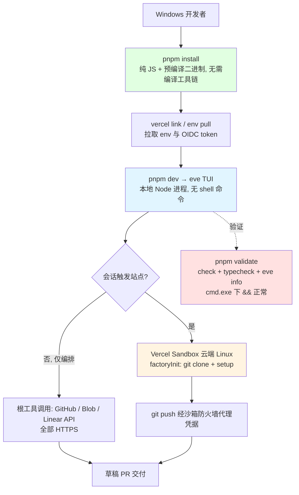

# eve Software Factory Template (Foreman) - Windows 兼容性分析

> 生成时间: 2026-09-30
> 分析方法: 脚本扫描 (windows-compat-checker) + 源码针对性检查 (child_process / process.platform / path / os / 符号链接 / POSIX 路径 grep) + 工具链核实

## 总体评估

| 指标 | 结果 |
|------|------|
| 总体评级 | ✅ 完全兼容 (开发用途) |
| 高危问题 | 0 |
| 中危问题 | 0 |
| 低危问题 | 3 |
| 已正确适配项 | 6 |

### 评级说明

本项目在 Windows 上的定位很特殊:**本地只承担"开发与调试"(编辑、类型检查、lint、TUI 会话),所有涉及 shell 命令的运行时逻辑(git 克隆、构建、测试)都在云端 Vercel Sandbox(Linux)里执行**。这一架构性选择天然消除了传统跨平台项目的大部分 Windows 风险。生产部署也全在 Vercel 上,与本地 OS 无关。

| 等级 | 含义 |
|------|------|
| ✅ 完全兼容 | 项目可在 Windows 上正常构建和运行 |
| ⚠️ 部分兼容 | 可构建但部分功能不可用,需少量修复 |
| ❌ 不兼容 | 无法在 Windows 上构建或核心功能不可用 |

## 1. 构建系统兼容性

### 1.1 package.json Scripts

| Script | 命令 | 问题 | 严重程度 |
|--------|------|------|----------|
| dev | `eve dev` | 无 | ✅ |
| build | `eve build` | 无 | ✅ |
| start | `eve start` | 无 | ✅ |
| check / fix | `ultracite check` / `ultracite fix` | 无(Biome 原生支持 Windows) | ✅ |
| typecheck | `tsc` | 无 | ✅ |
| eval | `eve eval` | 无 | ✅ |
| validate | `pnpm run check && pnpm run typecheck && eve info` | 经 `pnpm run` 执行时由 Windows 上的 cmd.exe 充当脚本 shell,`&&` 正常;直接把命令粘进 PowerShell 5.1 才会解析报错(见 8.3) | 低 |

### 1.2 生命周期 Hooks

未发现 preinstall / postinstall 等生命周期 hooks(扫描确认)。无由此引入的 POSIX shell 依赖。✅

### 1.3 构建工具链

| 工具 | Windows 支持 | 说明 |
|------|-------------|------|
| Node.js 24.x | ✅ | engines 钉死 24.x,官方提供 Windows 安装包 |
| pnpm | ✅ | 原生 Windows 支持;符号链接用 junction 实现,无需开发者模式处理 npm 生态的 symlink 问题 |
| TypeScript 7.0.2 | ✅ | 纯 JS 实现,tsc 在 Windows 上无差异 |
| Biome (ultracite) | ✅ | 按平台分发预编译二进制(`@biomejs/biome` 带平台可选依赖),无 node-gyp 编译 |
| Vercel CLI (`vercel link` / `vercel env pull` / `eve deploy`) | ✅ | 官方跨平台 CLI |
| eve CLI (`eve dev` / `eve build` / `eve info` / `eve eval`) | ✅ | Node 生态 CLI;TUI 建议在 Windows Terminal 中运行(见 8.3) |

## 2. 源代码兼容性

### 2.1 child_process 调用

**grep 结果: agent/ 与 evals/ 全部 73 个 TS 文件中零命中**(`child_process`、`exec`、`spawn` 均无)。

项目自身的 Node 代码不启动任何本地子进程。唯一的命令执行路径是 `sandbox.run({ command })`——命令字符串被发送到**远程 Vercel Sandbox**(Linux)执行,例如 `agent/lib/github/repo-sandbox.ts:129-148` 中的 `git config ... && git clone --depth 50 ...`。这些 POSIX 命令(`&&` 链、`--global`、`/workspace` 路径)全部运行在云端 Linux 内,与本地 Windows 无关。✅

### 2.2 平台相关代码

| 检查项 | 结果 |
|------|------|
| `process.platform` 分支 | 零命中 |
| `os` 模块(homedir/tmpdir 等) | 零命中 |
| `path.sep` / 手工拼接平台分隔符 | 零命中 |
| `__dirname` (CJS 遗留) | 零命中(项目为纯 ESM) |
| 硬编码本地 POSIX 路径 (/tmp, /usr, /bin) | 零命中;`/workspace`、`REPO_DIR = "/workspace/repo"` 均为远程沙箱路径 |

### 2.3 Unix 专用 API

| API | 文件 | 说明 |
|-----|------|------|
| (无) | — | 无 signal 处理(SIGTERM/SIGKILL)、无 Unix socket、无文件权限位(如 0o755)依赖 |

补充:git 凭据经 `brokerPolicy`(`agent/lib/github/git-remote.ts:66-78`)在沙箱防火墙注入 Authorization header,沙箱网络策略由云平台执行,本地无 iptables/代理类依赖。

## 3. 文件系统兼容性

### 3.1 路径处理

| 问题 | 结论 |
|------|------|
| 仓库代码中的绝对路径 | 仅 `/workspace`(远程沙箱);本地路径一律由 `process.env` / Node API 提供 |
| package.json `imports` 字段的 `./agent/*` 映射 | 由 Node ESM 加载器解析,平台无关 ✅ |
| ESM 相对导入 `.js` 后缀 | NodeNext 规范要求,与平台无关 ✅ |
| 路径深度 / MAX_PATH | 项目目录很浅(agent/ 下最多 4 层);pnpm 的 store 布局比 npm 扁平,一般不会触碰 260 字符限制;若极端环境出问题,开启 Windows 长路径(regedit LongPathsEnabled)即可 ✅ |
| 大小写敏感性 | 目标运行环境(Linux 沙箱 + tsc)本身强制区分大小写,TypeScript NodeNext 会报大小写不匹配的导入错误,风险在写代码时就被拦截 ✅ |

### 3.2 符号链接

仓库自身不创建符号链接。pnpm 在 Windows 上用 junction 实现 node_modules 链接,无需特权。✅

## 4. Shell 和脚本兼容性

### 4.1 Shell 脚本

扫描确认:**仓库不含任何 .sh / .ps1 / .cmd 文件**,也没有 Dockerfile / docker-compose(部署走 Vercel)。✅

### 4.2 环境变量

| 变量 | 说明 |
|------|------|
| `FACTORY_REPO` / `FACTORY_LABEL` / `FACTORY_SETUP_COMMAND` / `FACTORY_BRANCH_PREFIX` / `FACTORY_BOT_NAME` | 经 `.env` 文件由 `vercel env pull` / Vercel 平台注入,Node 统一读取 `process.env`,平台无关 |
| `GITHUB_CONNECTOR` / `LINEAR_CONNECTOR` | 同上;`.env*` 已 gitignore |

无代码内联 `VAR=x cmd` 这类 POSIX env 前缀语法。✅

## 5. 测试和 CI/CD 兼容性

### 5.1 CI 配置

仓库内**没有 GitHub Actions workflow**(模板的验收方式是 `pnpm validate` + `pnpm eval`,部署走 Vercel),因此不存在 runner 平台差异问题。若你 fork 后自建 CI,建议 `runs-on: ubuntu-latest` 即可,评测与构建均为平台无关的 Node 任务。

### 5.2 测试覆盖

| 测试类型 | Windows 是否可运行 | 说明 |
|----------|-----------------|------|
| `pnpm typecheck` / `pnpm check` | ✅ | 纯 Node 工具 |
| `pnpm eval --tag fast` | ✅ | 模型调用走网络,沙箱在云端 |
| `pnpm eval pipeline/full-pipeline` | ✅(但注意) | 会向真实仓库推送 `factory/*` 分支,与平台无关;务必只对 scratch 仓库运行 |

## 6. 依赖兼容性

### 6.1 原生模块

| 依赖 | 是否需要编译 | Windows 支持 |
|------|-------------|-------------|
| @biomejs/biome | 否(预编译二进制,平台作为可选依赖分发) | ✅ |
| typescript / ultracite / eve / ai / zod / @vercel/blob / @vercel/connect / @github-tools/eve-extension | 否(纯 JS) | ✅ |

**无 node-gyp、无 C++ 工具链要求。** `pnpm install` 在干净的 Windows 环境可直接完成。

### 6.2 可疑依赖

无。zod 钉死精确版本 4.6.5 只影响升级策略,不影响平台兼容性。

## 7. 已正确处理的适配

| 适配项 | 文件 | 处理方式 |
|--------|------|----------|
| 全部 shell 命令上云 | `agent/lib/github/repo-sandbox.ts:48-62` | `sandbox.run()` 把命令发往 Vercel Sandbox(Linux)执行,本地 OS 完全不参与 |
| 根沙箱初始化同样远程化 | `agent/sandbox.ts:29` | `git config --global --add safe.directory /workspace` 在云端执行,POSIX 路径不落本地 |
| Git 凭据零本地依赖 | `agent/lib/github/git-remote.ts:66-78` | Authorization header 由沙箱防火墙在出口注入,无需本地 git 凭据助手(Windows 上常见的 credential-manager 差异被整体绕开) |
| 配置全部走 env + Node 读取 | `agent/lib/constants.ts` | `requireEnv` 读 `process.env`,平台无关 |
| 纯 ESM + NodeNext | `package.json` / `tsconfig.json` | 无 CJS/ESM 双态混用,规避 Windows 上 loader 差异的常见坑 |
| 包管理器统一 pnpm | `pnpm-lock.yaml` / `pnpm-workspace.yaml` | junction 链接策略对 Windows 友好 |

## 8. 修复建议

### 8.1 必须修复 (HIGH)

无。未发现任何会阻碍 Windows 上安装、构建、类型检查、lint、TUI 会话与评测的问题。

### 8.2 建议修复 (MEDIUM)

无。

### 8.3 可选改进 (LOW)

1. **PowerShell 5.1 直接执行 `validate` 链会报错**:`pnpm run check && pnpm run typecheck && eve info` 若被原样粘进 Windows PowerShell 5.1(PowerShell 7+ 无此问题),`&&` 是解析错误。经 `pnpm run validate` 调用则完全正常(cmd.exe 充当 shell)。建议在团队文档里写明"Windows 下用 `pnpm validate`,或升级 PowerShell 7"。这是文档级提示,无需改代码。
2. **TUI 建议用 Windows Terminal 运行**:`eve dev` 的 TUI 在传统 conhost(老式 cmd 窗口)中可能渲染不佳,建议在 Windows Terminal 或 VS Code 集成终端中运行。此为一般性 TUI 建议,未在本机实测验证,记录为推断。
3. **长路径保险**:若你的 Windows 环境启用了严格 260 字符路径限制且把仓库放在很深的目录下,`pnpm install` 理论上可能触碰限制;建议仓库放浅目录(如 `D:\dev\...`),或开启系统长路径支持。当前布局(pnpm store + 浅目录)一般不会触发。

## 9. 兼容性流程图

## 总结

这个模板在 Windows 上的兼容性是**架构性优秀**而非"逐项修补"出来的:仓库自身的 TypeScript 代码零子进程、零平台分支、零本地路径假设;一切需要 POSIX 环境的工作都被推到云端 Vercel Sandbox。Windows 开发者只需要 Node 24 + pnpm + Vercel CLI 就能完成完整闭环(安装 → 校验 → TUI 调试 → 部署)。三条低危提示(PowerShell 5.1 的 `&&`、TUI 终端选择、长路径)均为使用习惯层面,不需要修改任何代码。
