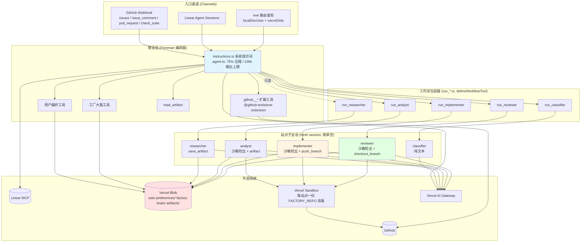
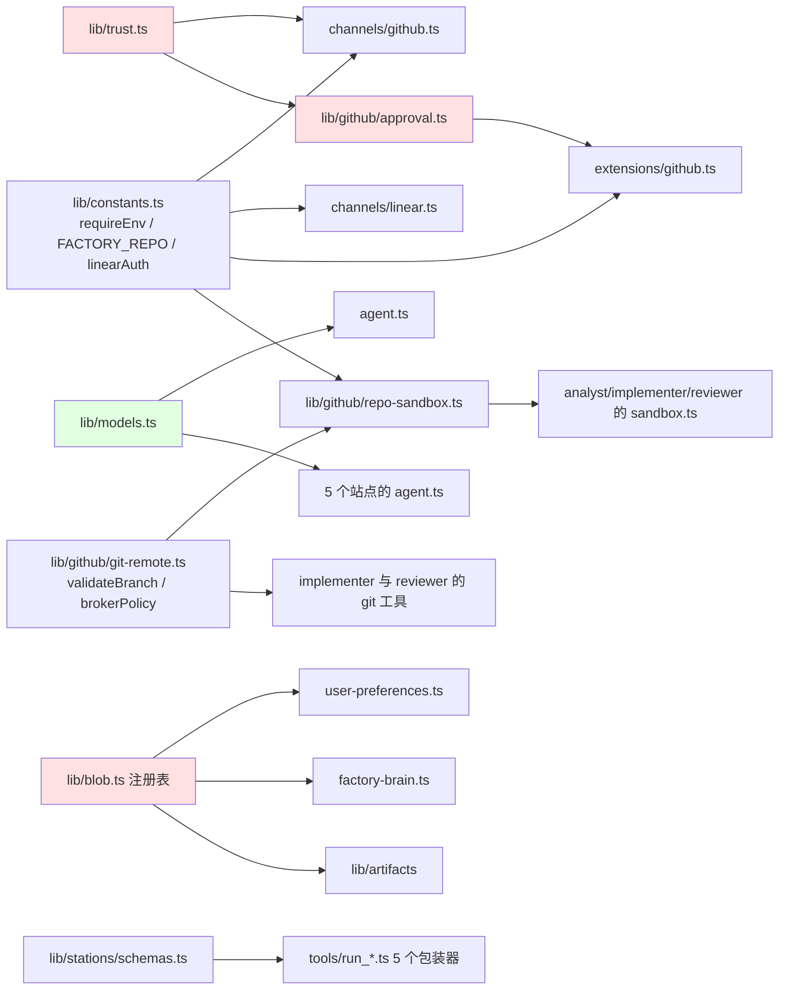

# eve Software Factory Template (Foreman) - 架构分析

> 生成时间: 2026-09-30
> 分析方法: 脚本扫描 (project-info / structure-analyzer / dependency-scanner) + 源码验证 (AGENTS.md, .github/ARCHITECTURE.md, agent/ 关键文件)

## 1. 项目概览

### 1.1 项目信息

| 项目 | 内容 |
|------|------|
| 名称 | eve-software-factory-template (代理名为 Foreman) |
| 维护方 | Vercel Labs (Ben Sabic) |
| 语言 | TypeScript (strict, ESM, NodeNext 模块解析) |
| 类型 | AI Agent 编排器 / 软件工厂模板 |
| 描述 | 基于 eve 框架的编排 Agent,把 GitHub / Linear 的工单流转过四个站点(classifier → analyst → implementer → reviewer),最终交付一个经过审查的草稿 Pull Request |
| 许可证 | MIT |
| 运行平台 | Vercel (生产 `eve deploy`) / 本地 TUI (`pnpm dev`,同一运行时) |
| 代码规模 | agent/ + evals/ 共 73 个 TS 文件,约 3720 行 |

### 1.2 目录结构

```text
eve-software-factory-template/
├── package.json              # pnpm 脚本: dev/build/check/eval/validate
├── tsconfig.json             # TypeScript strict 配置
├── biome.jsonc               # Ultracite (Biome 预设) lint 配置
├── .env.example              # 环境变量模板 (连接器 UID + FACTORY_* 配置)
├── AGENTS.md / CLAUDE.md     # AI 协作 Agent 的仓库指南
├── README.md
├── .github/
│   └── ARCHITECTURE.md       # 人工维护的组件地图 / 信任模型 / 边界
├── agent/                    # ← eve 从文件系统发现全部能力,无中央注册表
│   ├── agent.ts              # 根 Agent (编排器): 模型 + 会话预算 + 75% 压缩阈值
│   ├── instructions.ts       # defineInstructions: 编排器系统提示词,构建期注入 FACTORY_REPO
│   ├── sandbox.ts            # 根沙箱 (Vercel Sandbox),渠道线程的仓库检出
│   ├── channels/             # 入站/出站通道
│   │   ├── github.ts         # GitHub webhook: onComment / onIssue / onCheckSuite / onPullRequest
│   │   ├── linear.ts         # Linear Agent Sessions
│   │   └── eve.ts            # eve 路由鉴权 (localDevUser + vercelOidc)
│   ├── connections/
│   │   └── linear.ts         # Linear MCP 服务器连接 (app 级 Connect 授权)
│   ├── extensions/
│   │   └── github.ts         # 挂载 @github-tools/eve-extension → github__* 工具
│   ├── subagents/            # 5 个站点,每个含 agent.ts (tool:false) + instructions.md
│   │   ├── classifier/       # 快速分诊 (纯文本)
│   │   ├── researcher/       # 可选的全新上下文网络研究员 (+ save_artifact)
│   │   ├── analyst/          # 规划 + 验收标准 (自带仓库检出沙箱 + artifact 工具)
│   │   ├── implementer/      # 编码 + 验证 + push_branch (自带沙箱 + git 工具)
│   │   └── reviewer/         # 独立审查 (不同模型厂商, 自带沙箱 + checkout_branch)
│   ├── tools/                # 模型可调用工具 (文件名即工具名)
│   │   ├── run_{classifier,researcher,analyst,implementer,reviewer}.ts   # 工作流包装器
│   │   ├── {get,save,clear}_user_preferences.ts   # 逐用户偏好 (Blob)
│   │   ├── {read,update}_factory_brain.ts         # 共享工厂大脑 (Blob)
│   │   └── read_artifact.ts / agent.ts (disableTool) / glob / grep
│   ├── lib/                  # 共享库
│   │   ├── constants.ts      # requireEnv + FACTORY_REPO 校验 + linearAuth
│   │   ├── trust.ts          # 唯一信任权威: AUTONOMOUS_PRINCIPAL / isTrusted / isAutonomous
│   │   ├── blob.ts           # Blob 命名空间注册表 (所有保留前缀 + 守卫) + 读写助手
│   │   ├── models.ts         # MODELS 映射: 每个模型的网关 id 集中一处
│   │   ├── user-preferences.ts / factory-brain.ts   # Blob key 派生 (永不取自模型输入)
│   │   ├── artifacts/        # 交接工件: config.ts (id 模式) + tools.ts (工具工厂)
│   │   └── github/
│   │       ├── approval.ts   # 8 个审批策略 (授权策略即审批谓词)
│   │       ├── git-remote.ts # validateBranch / brokerPolicy / REMOTE_URL / 令牌铸造
│   │       ├── repo-sandbox.ts       # createFactoryEnvironment + factoryInit (共享沙箱初始化)
│   │       ├── credentials.ts        # GITHUB_CONNECTOR + Connect 凭据句柄
│   │       ├── bot-name.ts          # 从连接器解析 @mention 名
│   │       └── bootstrap-diagnostics.ts  # 克隆失败 → 可操作错误消息
│   └── skills/               # 按需加载的 Markdown 程序 (description 前置元数据路由)
│       ├── writing-quality/  # AI 痕迹 / 平实英语写作规范
│       ├── triaging-issues/  # 工单落地: 查重 / 原生标签 / 询问或推进
│       └── github-linear-bridging/  # 跨追踪器桥接约定
└── evals/                    # eve eval 套件
    ├── smoke.eval.ts / evals.config.ts / helpers.ts
    ├── routing/              # 路由断言 (classifier 优先等)
    ├── safety/               # 安全断言 (7 个: 提示注入 / 直推 main 拒绝 / 船闸审批...)
    └── pipeline/full-pipeline.eval.ts   # 真跑全流水线 (opt-in, 推真实分支)
```

## 2. 架构设计

### 2.1 架构模式

本项目是**文件系统驱动的多 Agent 编排架构**(Filesystem-discovered Multi-Agent Orchestration),叠加了以下模式:

- **约定优于配置 (Convention over Configuration)**:eve 框架从 `agent/` 目录的文件名/目录名发现能力——`agent/tools/foo.ts` 即工具 `foo`,`agent/subagents/bar/` 即子代理 `bar`,`agent/extensions/baz.ts` 即命名空间 `baz`。没有中央注册表或接线文件。
- **编排器-工作者 (Orchestrator-Workers)**:根 Agent (Foreman) 只做路由、交接验证、组装结果,从不自己写代码或做深度分析;每个站点是一个隔离子会话。
- **管道 + 评审环 (Pipeline with Review Loop)**:四个站点严格有序,reviewer 最多触发 2 轮返工 (request_changes → implementer → reviewer)。
- **策略对象模式 (Policy Objects)**:授权策略是 `agent/lib/github/approval.ts` 中的纯函数,每个返回 `not-applicable`(直接运行)/ `user-approval`(停下等人)/ `denied`(服务端一步拒绝)。
- **零信任输入 + 单一信任权威**:调用者信任在派发时由通道(基于签名 webhook)盖章进会话 auth,`agent/lib/trust.ts` 是唯一读取处;下游任何组件不再从模型可读内容重新推导信任。
- **命名空间注册表 (Namespace Registry)**:所有保留 Blob 前缀(`user-preferences/`、`factory-brain/`、`artifacts/`)集中登记于 `agent/lib/blob.ts`,带守卫,通用 Blob 工具必须先过注册表。
- **结构化交接 (Structured Handoff)**:站点间长文档通过 Blob 中的交接工件按 id 传递,编排器只转发 id;每条委托消息自包含(站点看不到编排器历史)。

### 2.2 核心模块

| 模块 | 职责 | 关键文件 |
|------|------|----------|
| 编排器 (Foreman) | 按序调度站点、验证交接、运行评审环(≤2 轮)、开草稿 PR、回报;从不写代码 | `agent/agent.ts`, `agent/instructions.ts` |
| GitHub 通道 | 工单/提及/CI 失败/PR 事件的入口;派发时盖章信任或重写为自治主体 | `agent/channels/github.ts` |
| Linear 通道 + 连接 | Agent Sessions 入口(全部盖 trusted)与 MCP 写出 | `agent/channels/linear.ts`, `agent/connections/linear.ts` |
| 信任权威 | 唯一定义调用者信任之处:trusted / autonomous / schedule 谓词与盖章函数 | `agent/lib/trust.ts` |
| 审批策略 | 8 个策略函数,决定每个 GitHub 写操作按调用者类别如何落地 | `agent/lib/github/approval.ts` |
| Git 安全 | validateBranch(拒绝 main/master/refs//HEAD/元字符)、字面 REMOTE_URL、防火墙代理令牌 | `agent/lib/github/git-remote.ts` |
| 站点沙箱 | 共享环境选项 + 每会话 factoryInit(克隆 FACTORY_REPO、装依赖) | `agent/lib/github/repo-sandbox.ts` |
| 工作流包装器 | 每站点的模型侧入口,阻塞于 `ctx.agent(id, {message, outputSchema})` | `agent/tools/run_*.ts`, `agent/lib/stations/schemas.ts` |
| Blob 层 | 命名空间注册表 + 共享文档读写助手;逐用户偏好 / 工厂大脑 / 交接工件 | `agent/lib/blob.ts`, `user-preferences.ts`, `factory-brain.ts`, `artifacts/` |
| 技能 | 按需加载的流程说明,按 description 路由 | `agent/skills/*/SKILL.md` |
| 评测 | 路由与安全断言(对写工具列表默认拒绝),opt-in 全流水线真跑 | `evals/` |

### 2.3 站点 (子代理) 分工

| 站点 | 模型 (Vercel AI Gateway id) | 沙箱 | 专属工具 | 产出 |
|------|------|------|------|------|
| classifier | `openai/gpt-5.6-terra-fast` | 无(纯文本) | 无 | 类型/优先级/复杂度/区域/是否可行动/需澄清 |
| researcher (可选) | `openai/gpt-5.6-terra-fast` | 无 | `save_artifact` | 带引用的研究结论 + 缺口 |
| analyst | `openai/gpt-5.6-terra-fast` | 仓库克隆 | `save/read_artifact`, `glob`, `grep` | 问题陈述/方案/计划/风险/验收标准/测试策略 |
| implementer | `anthropic/claude-fable-5` (最强编码模型) | 仓库克隆 | `checkout_branch`, `push_branch`, `read_artifact`, `glob`, `grep` | 分支 + 逐文件变更摘要 + 验证结果 |
| reviewer | `openai/gpt-5.6-terra-fast` (与 implementer 不同厂商,刻意保持独立) | 仓库克隆 | `checkout_branch`, `read_artifact`, `glob`, `grep` | approve / request_changes / reject,逐条验收标准判定 |

模型分配集中在 `agent/lib/models.ts:4-11` 的 `MODELS` 映射,每个 `agent.ts` 读自己的条目,换模型是单行编辑。implementer 与 reviewer 分属不同厂商是该仓库刻意维持的不变量。

### 2.4 架构图



### 2.5 信任与授权模型(本架构的核心不变量)

- **信任在派发时决定,不在提示词里**:GitHub 通道对 OWNER/MEMBER/COLLABORATOR 的提及盖 `trusted` 章;`factory` 标签进件把会话 auth 重写为构造的自治主体 `github:foreman-factory`(`agent/lib/trust.ts:15`),并盖章 intake issue 号;Linear 会话全部 trusted。
- **审批谓词即授权策略**:`writePolicy`(基线可逆写)、`commentPolicy`(自治运行只能评论自己的进件 issue)、`labelPolicy`(标签放行)、`shipPolicy`(标记 ready 永远等人)、`createPullRequestPolicy`(`draft: true` 对所有人放行)、`closeIssuePolicy`(可逆分诊,全放行)、`updateIssuePolicy`(按是否带 state 分流)、`factoryBrainPolicy`(自治运行禁写共享大脑)。
- **自治运行被拒绝而非挂起**:无人值守会话没有人在看审批卡,服务端一步 `denied` 胜过永久搁浅。
- **草稿 PR 是无人值守的天花板**:能交付成果又不能合并;合并工具根本不在工具面里。

## 3. 依赖关系分析

### 3.1 外部依赖

| 依赖 | 版本 | 用途 |
|------|------|------|
| eve | ^0.67.2 | Agent 框架本体:defineAgent/defineTool/defineWorkflowTool/通道/沙箱/eval 等原语,以及 `eve dev`/`eve build`/`eve deploy` CLI |
| @github-tools/eve-extension | ^0.8.0 | 预构建 GitHub 工具面,挂载后以 `github__*` 出现(显式 include 白名单) |
| @vercel/blob | ^2.8.0 | Blob 存储:用户偏好 / 工厂大脑 / 交接工件(OIDC 鉴权) |
| @vercel/connect | ^2.3.3 | Vercel Connect:GitHub/Linear 凭据代理,令牌按调用解析、永不暴露给模型 |
| ai | ^7.0.120 | Vercel AI SDK(eve 的底层模型抽象) |
| zod | 4.6.5 | 工具输入/输出与站点 outputSchema 校验 |

开发依赖:`typescript 7.0.2`、`@types/node ~24.19.0`、`@biomejs/biome ^2.5.14`、`ultracite ^7.12.1`(Biome 预设的 lint/format,`pnpm check`/`pnpm fix`)。

### 3.2 模块依赖图(简化)



依赖方向清晰:`lib/` 是叶子库,通道/扩展/站点工具单向引用它;`trust.ts` 和 `blob.ts` 是两处被最广泛引用的权威模块(信任与存储命名空间)。

### 3.3 依赖健康度

- 总依赖数: 6 生产 + 4 开发,对一个 Agent 项目非常克制
- 无原生编译依赖(Biome 按平台分发预编译二进制,TypeScript/ultracite 为纯 JS)
- 最近一次提交 (6bc5feb) 刚完成 eve 0.67 与全依赖升级,依赖较新
- 注意点:`zod` 钉死在精确版本 4.6.5(非 `^` 范围),升级需显式改 package.json

## 4. 设计亮点与权衡

- **能力即文件**:新增工具/站点/技能只需落一个文件,eve 编译器负责接线;代价是"同名冲突"这类约束(工具不能与本地子代理同名,所以包装器叫 `run_classifier` 而不是 `classifier`)要靠命名约定承载。
- **站点继承空**:每个站点在全新子会话运行,不继承根的指令/技能/连接/工具/沙箱——隔离是结构性的,委托消息必须自包含;长内容走 Blob 工件,只传 id。
- **审批卡不进站点**:站点内没有人在看审批卡,所以站点工具必须天然惰性(如 `push_branch`:只允许 feature 分支、校验过的名字、代理凭据)。
- **凭证不进沙箱**:克隆/推送瞄准字面 `https://github.com/<FACTORY_REPO>.git`(永不走模型可写的 `origin`),安装令牌在沙箱防火墙作为出口 header 变换注入,finally 中撤销。
- **无应用数据库**:凡需跨会话存续的状态(偏好/大脑/工件)都在 Vercel Blob;Git 线程本身是 CI 修复环唯一的跨会话记忆(数修复尝试的评论)。

## 5. 总结

这是一个把"多 Agent 流水线"作为一等公民的参考架构:编排器薄、站点专、信任集中、副作用惰性化。它演示的模式——文件系统发现、策略对象授权、结构化交接、命名空间化存储——对任何构建审查式 AI 交付流水线的团队都有直接参考价值。
