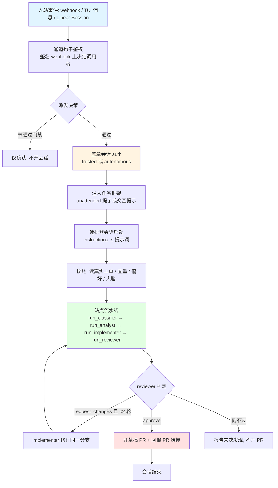
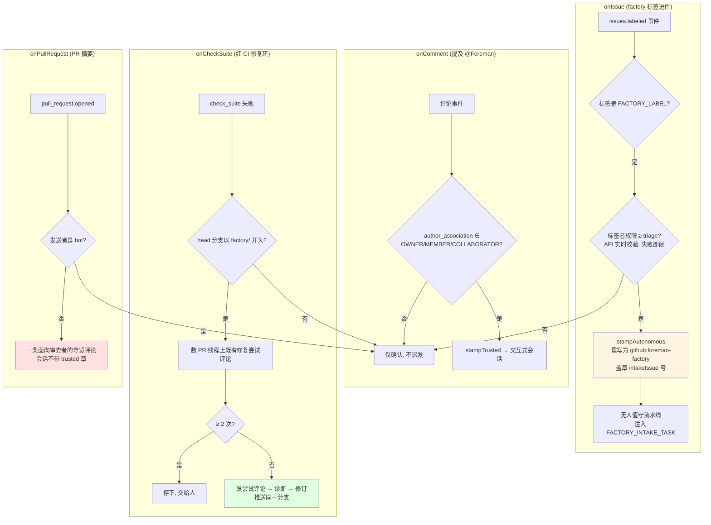
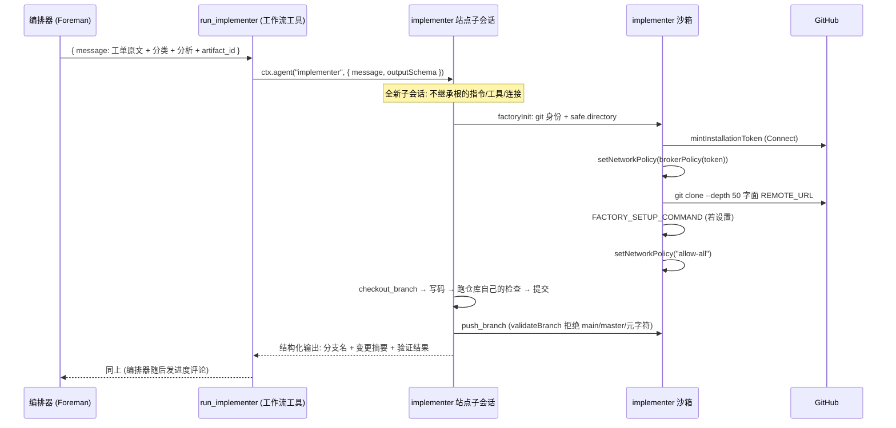
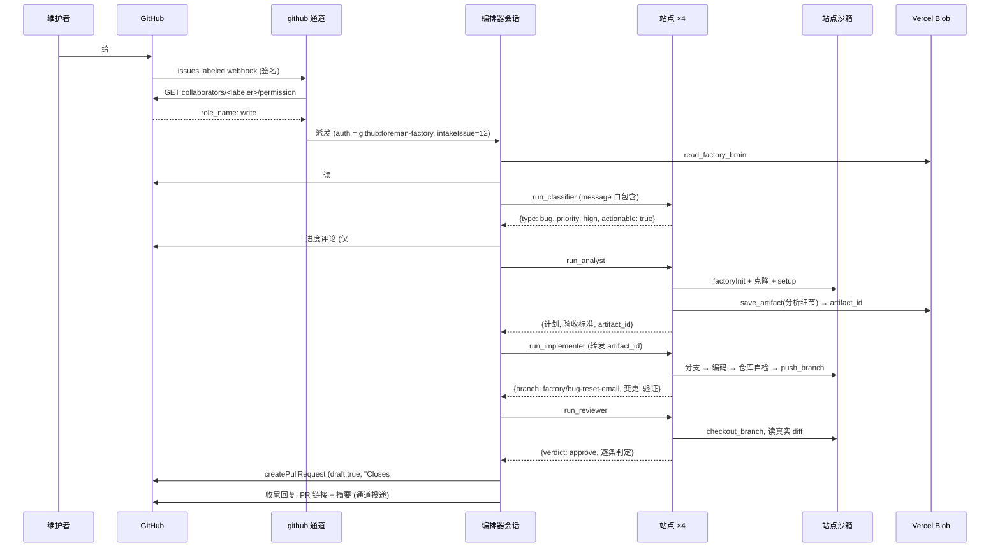
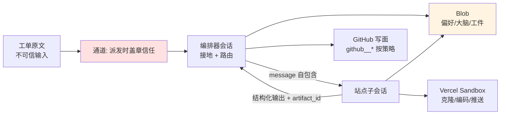
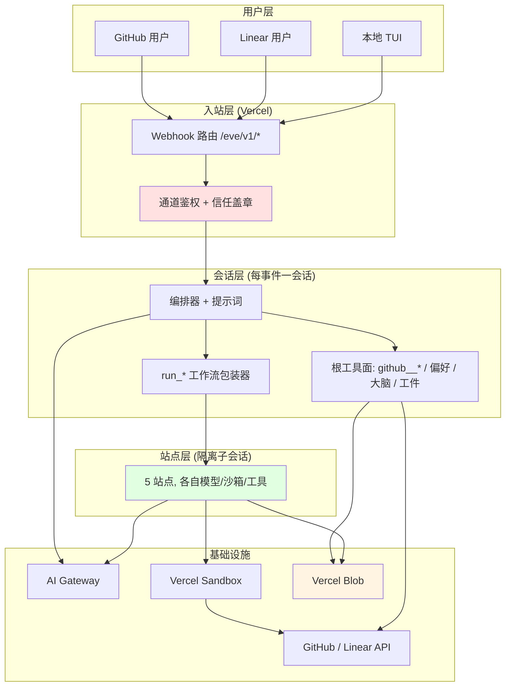

# eve Software Factory Template (Foreman) - 运行机制详解

> 生成时间: 2026-09-30
> 分析方法: 脚本扫描 (runtime-tracer) + 源码追踪 (channels/github.ts, lib/github/repo-sandbox.ts, lib/trust.ts, lib/github/approval.ts, instructions.ts)

## 一、项目运行方式

本项目没有传统的 `main()` 入口。它是一个**声明式 Agent 应用**:代码只声明"是什么"(模型、工具、通道、沙箱、提示词),由 eve 框架在构建期编译成可部署单元,在 Vercel 上作为事件驱动服务运行;本地 `pnpm dev` 启动的是同一运行时的 TUI。每个入站 webhook 或用户消息开启(或续接)一个 Agent 会话,会话内的执行由 LLM 按提示词驱动、受工具面和审批策略约束。

### 1. 安装与执行

```bash
pnpm install        # 安装依赖 (Node 24.x)
pnpm dev            # 本地 TUI;先运行 /model 链接模型提供商
pnpm validate       # check + typecheck + eve info (0 错误 / 0 警告)
pnpm eval --tag fast # 便宜的评测环 (真实 token)
eve deploy          # 部署到 Vercel 生产 (不要用裸 vercel deploy)
```

本地开发前置:

```bash
vercel link         # 关联已部署项目
vercel env pull     # 拉取环境 (含短期 OIDC token,Connect 与沙箱需要)
pnpm dev
```

### 2. 会话生命周期总览



## 二、核心运行机制

### 2.1 通道派发与信任盖章 (入口机制)

**位置**: `agent/channels/github.ts:21-100`, `agent/lib/trust.ts:36-78`

**说明**: 四个 GitHub 钩子各自决定"谁的事件能开会话"以及"会话以什么身份运行"。



**机制作用**:

- **防伪造进件**:GitHub 对建 issue 时就带的标签也会触发 `labeled`,而 issue 模板允许未登录报告者这样做;所以钩子在派发前用 collaborators/permission API 实时验证标签者 ≥ triage 权限,API 出错则fail-closed 不派发。
- **身份重写**:标签进件绝不以标签者身份运行(否则等于把维护者权限借给工单内容);`stampAutonomous` 换成固定主体 `github:foreman-factory` 并把进件 issue 号盖进 auth 属性,后续 `commentPolicy` 靠它把评论范围锁死在进件线程。
- **线程即记忆**:CI 修复环每次派发都是全新会话,唯一的跨会话记录是 PR 线程;尝试评论在修复前发出,死在半途的运行也留下计数标记。
- **提及回复即授权信号**:审批卡以评论形式张贴并附提及式回复说明,回答走同一 `onComment` 门禁——不受信任账号的"approve"永远到不了等待中的会话。

### 2.2 站点调用:工作流包装器 (流水线执行机制)

**位置**: `agent/tools/run_classifier.ts:12-33`(五份同构), `agent/lib/stations/schemas.ts`

**说明**: 站点子代理声明 `tool: false`(对编排器隐藏),编排器实际调用的是 `run_<id>` 工作流工具:它以 Durable Workflow 执行,阻塞于 `ctx.agent(id, { message, outputSchema })`,把 `schemas.ts` 里对应站点的 JSON Schema 逐次挂上,拿到结构化输出后返回。



**机制作用**:

- **结构化交接**:每站输出匹配预定义 Schema(分支名、验收判定、分类字段等),编排器可验证、可机读,失败或畸形输出时重试一次再上浮。
- **消息自包含**:站点看不到编排器历史,包装器的 `message` 入参描述就是"它需要的一切";这同时是隔离边界和提示工程约束。
- **长文档走工件**:researcher/analyst 把研究备忘录、分析细节存为 Blob 工件,只在输出里带回 `artifact_id`;编排器转发 id,下游站点自己 `read_artifact`。提示词明令禁止把工件内容粘进站点消息、PR 正文或线程。
- **命名约束**:包装器不能与站点同名(`run_classifier` ≠ `classifier`),因为 eve 编译器拒绝工具与本地子代理共享公共身份。

### 2.3 站点沙箱引导 (factoryInit)

**位置**: `agent/lib/github/repo-sandbox.ts:125-153`, 选项在 `:25-29`

**说明**: analyst/implementer/reviewer 三个站点的沙箱每次会话执行同一初始化序列;快照策略(保留 1 份、14 天过期、4 vCPU)由 `FACTORY_SANDBOX_CREATE_OPTIONS` 统一供给。

初始化序列(命令在远程 Vercel Sandbox 内执行):

```bash
# 1. git 全局配置: safe.directory (模板快照属主是 builder uid, 不配则"dubious ownership"报错)
#    + 提交身份 (bot 名从连接器解析, SAFE_BOT_NAME 白名单后才进 shell 引号)
git config --global --add safe.directory /workspace && \
git config --global --add safe.directory /workspace/repo && \
git config --global user.name "<bot>[bot]" && git config --global user.email "<bot>[bot]@users.noreply.github.com"

# 2. 铸造安装令牌 (Connect; 拒绝被翻译成"Cannot access <owner/repo>"可操作错误, 原因挂 cause, 令牌不外泄)
# 3. sandbox.setNetworkPolicy(brokerPolicy(token))  ← 令牌作为 github.com 出口 header 注入, 不进沙箱进程
# 4. git clone --depth 50 https://github.com/<FACTORY_REPO>.git repo   ← 字面 URL, 不走 origin
# 5. cd repo && $FACTORY_SETUP_COMMAND   (如 pnpm install; 可选)
# 6. finally: setNetworkPolicy("allow-all")   ← 恢复常规出口, 装包/测试可用
```

**机制作用**:

- **每会话一克隆**:eve 的构建期快照沙箱没有 `setNetworkPolicy`,带凭据的克隆无法在模板期共享,所以退化为每会话全量浅克隆(depth 50),用快照保留策略控制存储成本。
- **失败要响**:任何一步非零退出即抛错(带消毒后的输出),不留半检出仓库;克隆失败被翻译成点名 `FACTORY_REPO` 和修复动作的诊断消息。
- **令牌零落沙箱**:Authorization header 由防火墙在出口注入,`finally` 撤销策略;令牌既不进沙箱文件系统,也不进错误消息。

### 2.4 审批策略即授权 (副作用门禁机制)

**位置**: `agent/lib/github/approval.ts:22-175`

**说明**: 每个扩展工具调用前,对应策略函数读会话 auth 的信任章,返回三态之一。关键分流:

| 策略 | 无人值守 (autonomous) | trusted / schedule | 其他 (含本地 TUI) |
|------|------|------|------|
| `writePolicy` (可逆写基线) | denied | 直接运行 | 审批卡 |
| `commentPolicy` (评论) | 仅自己的进件 issue 放行,其余 denied | 直接运行 | 审批卡 |
| `labelPolicy` (标签) | 放行(标记已接单) | 直接运行 | 审批卡 |
| `closeIssuePolicy` (关/重开) | 放行(可逆分诊) | 放行 | 放行 |
| `createPullRequestPolicy` | `draft:true` 放行;非草稿走 shipPolicy | 非 draft 同右 | 非 draft 审批卡 |
| `shipPolicy` (标记 ready) | denied | **审批卡(人也停)** | 审批卡 |
| `factoryBrainPolicy` (大脑写) | denied(防投毒) | 直接运行 | 审批卡 |

`updateIssuePolicy` 按 `state` 字段有无分流到 close/write 两条路径,保证两条到达同一动作的路径行为一致。

**机制作用**:

- **拒绝而非搁浅**:无人值守会话收到 `denied` 在服务端一步解决;`user-approval` 会挂起等卡,只有有人在看(交互会话/TUI)时才合理。
- **范围即隔离**:进件 issue 号盖在 auth 里(派发时、签名 webhook 上),`commentPolicy` 对照工具入参的 `issueNumber`,工单正文里的注入指令无法让运行去别处评论。
- **船闸只属于人**:标记 ready 对所有人类调用者都停卡;合并工具完全不在白名单。

### 2.5 共享记忆:偏好、大脑、工件 (状态机制)

**位置**: `agent/lib/user-preferences.ts`, `agent/lib/factory-brain.ts`, `agent/lib/artifacts/config.ts`, `agent/lib/blob.ts`

| 存储 | Blob 前缀 | key 派生 | 读 | 写 |
|------|------|------|------|------|
| 用户偏好 | `user-preferences/` | 已解析主体(principal)的哈希,永不取自模型输入 | 开放 | 保存走审批基线;清空 `always()` 审批 |
| 工厂大脑 | `factory-brain/` | `FACTORY_REPO` 的哈希 | 全部运行可读 | `factoryBrainPolicy` 门禁 |
| 交接工件 | `artifacts/` | 站点自铸带后缀 id;读取 id 必须匹配锚定 `ARTIFACT_ID_PATTERN`(小写字母数字连字符,无点斜杠) | 开放 | 永不覆盖 + 大小上限 |

工件 id 是模型唯一能 supplied 的 Blob 地址,锚定模式 + 保留前缀共同保证它指不到大脑或偏好文件;无效 id 读到 `found: false`,与不存在不可区分。这两点让工件工具可以 ungated 地住在站点里。

## 三、完整工作流(六条入站路径)

### 场景 1: 无人值守进件(核心路径)

```text
1. 维护者给 issue 打 factory 标签 (≥ triage 权限)
2. onIssue 派发 → stampAutonomous → 注入 unattended 任务框架
3. 编排器: get_user_preferences (无, 正常) + read_factory_brain + triaging-issues 技能查重
4. run_classifier → 分类; 若 needs_clarification → 在 issue 上发问并停止
5. (可选) run_researcher → 带引用的事实
6. run_analyst → 计划 + 验收标准 (在自己检出里)
7. run_implementer → 分支 factory/<type>-<slug> + 代码 + 仓库自检 + push_branch
8. run_reviewer → checkout_branch 看真实 diff, 逐条判定; request_changes 最多回炉 2 次
9. github__createPullRequest (draft:true) → 结束消息即 issue 上的收尾回复, 带 PR 链接
10. 中途每站完成在进件 issue 发一条进度评论 (commentPolicy 范围内)
```

### 场景 2: 红 CI 自动修复

```text
1. factory/* 分支的 PR 上 check_suite 失败 → onCheckSuite
2. 数线程上既有修复尝试评论; ≥2 次 → 停下交人
3. 否则先发本次尝试评论 (线程是唯一跨会话账本) → github__getCiFailureContext 诊断
4. implementer 在同一分支修订 → reviewer 复审 → 推送
```

### 场景 3-6: 其余路径

- **@Foreman 提及**(owner/member/collaborator):交互式,澄清问题直接问人,可逆写免卡,船闸动作停卡。
- **Linear Agent Session**:全程 trusted,进度以 Agent Activities 报告,PR 链接回报会话;跨追踪器约定来自 github-linear-bridging 技能。
- **本地 TUI**:dev principal 默认不受信,审批卡在 TUI 里浮出(也是演示审批流的方式)。
- **别人开了 PR**:onPullRequest 发一条含变更文件表的导览评论(摘要而非审查);bot 发送者跳过。

### 完整工作流序列图(无人值守进件)



## 四、数据流与状态管理

### 4.1 数据流转



### 4.2 关键数据结构

| 结构 | 用途 | 定义位置 |
|------|------|----------|
| `MODELS` 映射 | 每个角色 → AI Gateway 模型 id | `agent/lib/models.ts:4-11` |
| `SessionAuthContext` + attributes | 携带 trusted / intakeIssue 章的会话身份 | `agent/lib/trust.ts` |
| `ApprovalStatus` | `not-applicable` / `user-approval` / `{type:"denied", reason}` 三态 | `agent/lib/github/approval.ts` |
| 站点 outputSchema × 5 | 包装器逐次挂给 `ctx.agent` 的结构化输出契约 | `agent/lib/stations/schemas.ts` |
| `SandboxNetworkPolicy` | 出口策略: github.com 注入 Authorization,其余放行 | `agent/lib/github/git-remote.ts:66-78` |
| `ARTIFACT_ID_PATTERN` | 锚定的工件 id 白名单(防 Blob 键逃逸) | `agent/lib/artifacts/config.ts` |

### 4.3 状态管理

会话内状态由 eve 托管(75% 上下文触发压缩;每会话输出上限 100k token,四个站点从根配额取用);跨会话持久状态全部外置:GitHub(线程、PR、分支)、Linear(议题与交叉引用)、Vercel Blob(偏好/大脑/工件)、Sandbox 快照(14 天过期,保留 1 份)。模板明确"没有应用数据库",未来若加清扫调度需要跨运行去重状态,应进外部存储。

## 五、扩展机制

### 5.1 添加能力的方式(全部是落一个文件)

| 想加什么 | 怎么做 | 约束 |
|------|------|------|
| 新工具 | `agent/tools/<name>.ts` 导出 `defineTool` | 文件名即工具名;破坏性操作挂 `approval` 或信任策略 |
| 新站点 | `agent/subagents/<id>/` + `agent/tools/run_<id>.ts` 包装器 + `schemas.ts` 加 Schema | 站点内不得有需审批的工具;描述是路由提示 |
| 新技能 | `agent/skills/<name>/SKILL.md` 带 description 前置元数据 | 技能按 Agent 隔离,站点看不到根的技能 |
| 新通道/连接/扩展 | `agent/channels|connections|extensions/<ns>.ts` | 扩展工具以 `<ns>__<tool>` 出现;include 用裸名 |
| 新模型分配 | 改 `agent/lib/models.ts` 一行 | implementer 与 reviewer 保持异厂商 |
| 新 Blob 保留前缀 | 在 `agent/lib/blob.ts` 注册表加命名空间 | 永不做特性模块里的散落常量 |

### 5.2 钩子点

| 钩子 | 触发时机 | 用途 | 注册位置 |
|------|----------|------|----------|
| `onComment` | 评论提及 | OWNER/MEMBER/COLLABORATOR 门禁 + trusted 章 | `agent/channels/github.ts` |
| `onIssue` | `labeled` 且标签匹配 | 标签者权限校验 + autonomous 重写 | 同上 |
| `onCheckSuite` | check_suite 失败且 factory/* 分支 | 有界 CI 修复环 | 同上 |
| `onPullRequest` | PR opened(非 bot) | 单条导览摘要 | 同上 |
| `onAgentSession` | Linear Agent Session 事件 | trusted 章 + 注入请求者名 | `agent/channels/linear.ts` |
| 审批谓词 | 每次扩展工具调用前 | 三态授权决策 | `agent/extensions/github.ts` 挂接 `lib/github/approval.ts` |

### 5.3 配置管理

配置全部来自环境变量,在 `agent/lib/constants.ts` 模块加载期解析:`FACTORY_REPO` 必填且正则校验(owner/repo),缺失或畸形让发现期直接失败;`FACTORY_LABEL`/`FACTORY_BRANCH_PREFIX` 可选带默认;`FACTORY_SETUP_COMMAND` 可选;连接器 UID 从 `GITHUB_CONNECTOR`/`LINEAR_CONNECTOR` 读取。构建期 `defineInstructions` 把 `FACTORY_REPO` 织进编排器提示词,所以提示词按目标仓库静态定制。

## 六、运行时架构总结



## 总结

Foreman 的运行机制围绕以下核心概念:

1. **声明式表面**:代码声明能力,eve 从文件系统编译接线;没有 main,只有会话。
2. **派发时定信任**:签名 webhook 上的门禁与盖章是唯一信任来源,下游全是策略函数查章。
3. **流水线即工作流工具**:站点经 `run_*` 包装器以 Durable Workflow 阻塞调用,结构化 Schema 保证交接可验证。
4. **副作用惰性化**:站点内不允许出现需要审批的工具,`push_branch` 靠"只推 feature 分支 + 代理凭据"天然安全。
5. **线程与 Blob 即状态**:PR 线程当跨会话账本,Blob 当持久记忆,没有应用数据库。
6. **拒绝优于搁浅**:无人值守被 denied 一步解决,审批卡只出现在有人在看的会话里。

这种设计使项目既**保持了每个环节可审计、可撤销、人类把守船闸**,又**让无人值守路径真正能跑完而不挂死**,非常适合作为"AI 交付流水线 + 人类判断位"的参考实现。
